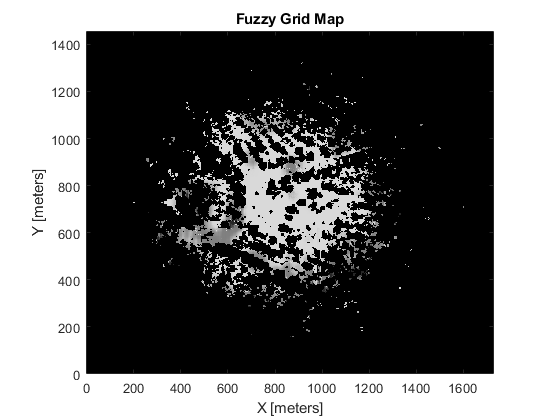
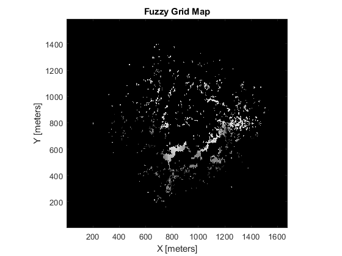

# Traversability (MATLAB)
SafeForest Traversability Code for generating traversability maps. The description of the approaches and the results can be found in the [paper](https://openreview.net/pdf?id=Bbx8xClhG9).

## Directory Structure
```
├── plots                               # Plots of DEM, Traversability map, etc.
├── point data                          # Point Cloud Data
├── variable data                       # Saved Variable Data
├── usrFunctions                        # Dependencies and other functions
│   ├── topo toolbox
│   ├── boxCountMoisy
│   ├── progress
│   └── clothSimulationFilter
├── digital_em.m                            # Digital Elevation Map Generation     
├── filter_pointcloud.m                     # CSF, SMRF Filtering
├── generate_tarversability.m               # Generate Traversability Function
├── grid_cloud.m                            # Grid Cloud Generation
├── main.m                                  # Main file for experiments
├── traversability_index.m                  # Traversability Index 
├── traversability_index_fuzzy.m            # Traversability Index (Fuzzy)
├── traversable_cloud.m                     # Traversable Cloud Calculation
├── trim_cloud.m                            # Point Cloud trimming
└── README.md   
```

## Usage
1. In MATLAB add all folders and sub-folders to Path
2. Use `generate_traersability` function to process point cloud data as :  
```matlab
generate_traversability('pilot data', '45_degree_merged')
```

## Plots



## Future Work and other details

